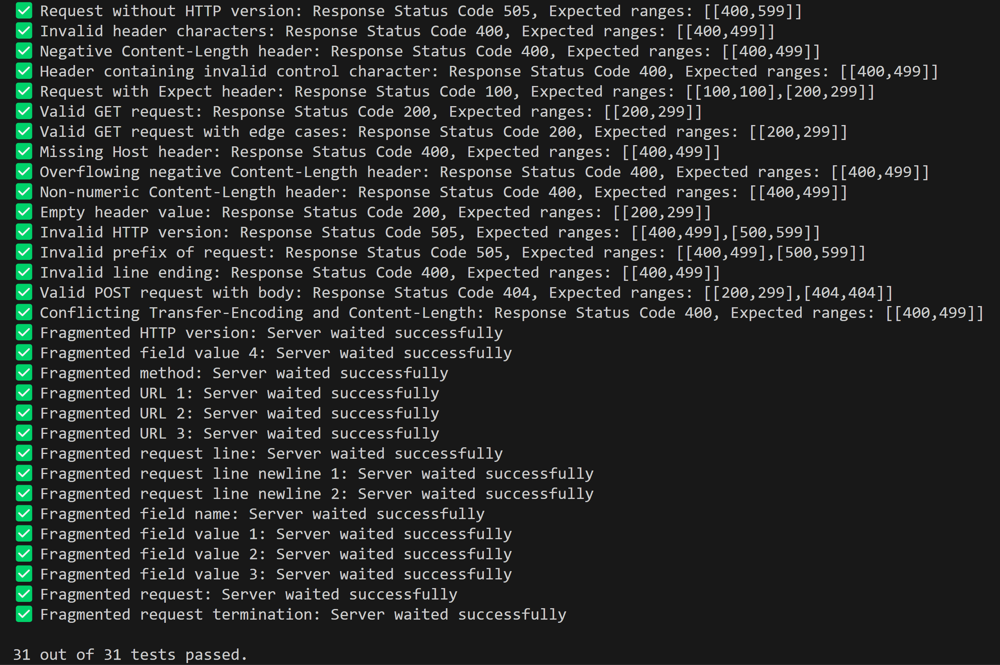

# h1spec
Quick and easy HTTP/1.1 server spec. compliance check that finishes in less than a second.

## Compliances as of 28th Oct 2024
| Deno     | Node.js     | Bun     | uWS | mrhttp
|--------------|--------------|--------------|---------|-------|
| 31/33 | 32/33 | 32/33 | 33/33 | 17/33 |

### How to run
The server should echo back whatever body it gets, under all methods.
If your server runs on localhost:8000 you run `deno run --allow-net http_test.ts localhost 8000`

### Example output
The test will run for at most 500ms but will finish immediately if the server is up to spec.

